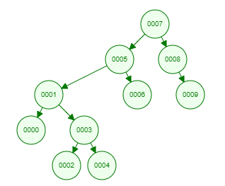

### [7, 5, 1, 8, 3, 6, 0, 9, 4, 2] 

1. Aşamada Bu dizide eğer root 7 olursa en tepeye 7 yazılır.
2. Aşamada 5, 7'den küçük olduğu için 7'nin soluna yazılır.
3. Aşamada 1, 5'den küçük olduğu için 5'in soluna yazılır.
4. Aşamada 8, 7'den büyük olduğu için 7'nin sağına yazılır.
5. Aşamada 3, 1'den büyük olduğu için 1'in sağına yazılır.
6. Aşamada 6, 5'ten büyük olduğu için 5'in sağına yazılır.
7. Aşamada 0, 1'den küçük olduğu için 1'in soluna yazılır.
8. Aşamada 9, 8'den büyük olduğu için 8'in sağına yazılır.
9. Aşamada 4, 3'ten büyük olduğu için 3'ün sağına yazılır.
10. Aşamada 2, 3'ten küçük olduğu için 3'in soluna yazılır.

#### Dizinin Son Hali : 